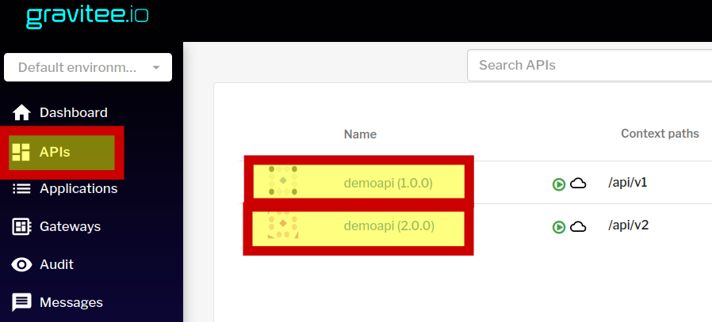

Соберем имиджи с необходимыми артефактами
`podman compose build`{{execute}}



запустим контейнеры с сервисами flink
`podman compose up -d taskmanager`{{execute}}

проверим статус контейнеров
`podman ps -a`{{execute}}

посмотрим логи flink jobmanager
`podman logs jobmanager`{{execute}}

Откроем интрейфейс [flink]([[UUID_SUBDOMAIN]]-8081-[[HOST]]/)

запустим sql клиент
`podman-compose run --rm sql-client`{{execute}}

создадим тестовую таблицу
```
CREATE TABLE MyTable (
  `user_id` BIGINT,
  `name` STRING,
  `timestamp` TIMESTAMP_LTZ(3) METADATA    -- use column name as metadata key
) WITH (
  'connector' = 'kafka'
);
```{{execute}}

выход

`exit();`{{execute}}

запустим контейнеры с сервисами kafka, zk
`podman compose up -d kafka`{{execute}}

Настроим venv для python
`python3 -m venv .env && source .env/bin/activate`{{execute}}

Тест pip3
`pip install pip-hello-world`{{execute}}
