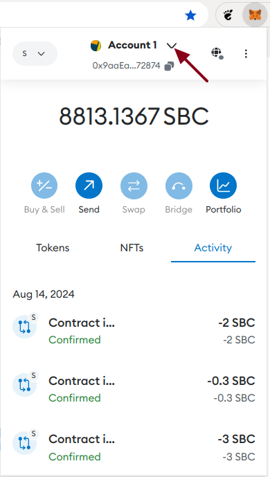
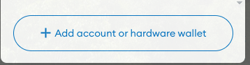
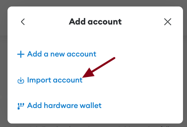
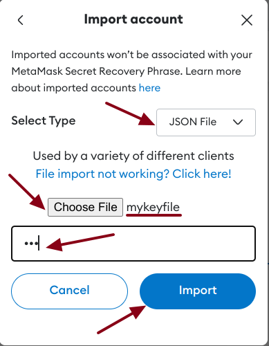
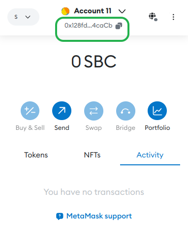

Кошелек, созданный в geth, можно импортировать в Metamask.  
При создании кошелька в geth мы указывали пароль: он потребуется при импорте.  

Сохраните в файл на своем ПК JSON File кошелька
`./keystore/mykeyfile`{{open}}

1. В браузере откройте окно плагина Metamask (введите пароль, заданный при установке, если необходимо).  
2. Щелкните на стрелке меню аккаунтов.

3. В открывшемся меню нажмите на " +Account or hardware wallet"

4. Выберите команду "Import account"

5. В окне импорта в поле Select Type выберите JSON File
6. Нажмите на кнопку "Choose File" и выберите сохраненный ранее JSON File кошелька
7. В поле ниже введите пароль (123) и нажмите на кнопку Import

8. Кошелек, созданный в geth, теперь импортирован в Metamask.

