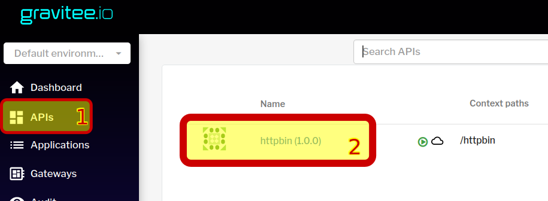
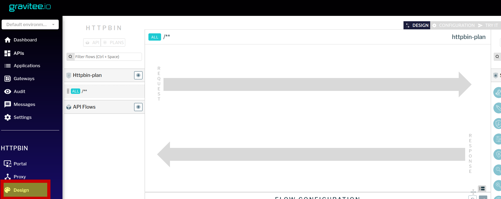
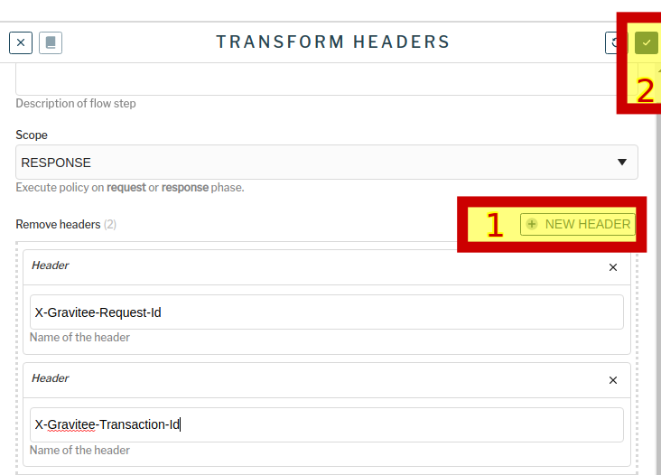

### Авторизация в gravitee apim
Откроем интерфейс gravitee apim по ссылке [gravitee ](https://[[HOST_SUBDOMAIN]]-32100-[[KATACODA_HOST]].environments.katacoda.com/)  и авторизуемся в нем  
```
права администратора
user: admin
pasword: admin
```
### Настройки плана
План предоставляет сервис и уровень доступа к апи для конкретных потребителей. В данном случае манипуляции с маппингами ответов мы будем осуществлять в рамках существующего ранее загруженного плана.  
После авторизации  в api gateway откроем наше api



И перейдем в дизайнер нашего плана



Добавим в респонс из блока "Transformation" компонент "Transform Headers" (перетащить мышью на стрелку responce)


В настройках укажем удалить не нужные нам заголовки.
Нажмем "ок", затем "save", чтобы сохранить изменения.



 И далее задеплоим изменения, нажав вверху экрана "deploy your api".
### Проверка изменений

Пробуем выполнить запрос к апи, опубликованному через api gateway.

`curl -v http://localhost:32100/gateway/httpbin/get`{{execute}}

Заметим, что httpbin работает как и раньше, он прислал в json ответа все заголовки, которые к нему пришли. В том числе и X-Gravitee-Request-Id, X-Gravitee-Transaction-Id.  
А вот в самом ответе api gateway эти заголовки отсутствуют. Они были удалены согласно выполенным настройкам.

Пример ответа:
```
< HTTP/1.1 200 OK
< Date: Sat, 25 Dec 2021 10:07:27 GMT
< Content-Type: application/json
< Content-Length: 484
< Connection: keep-alive
< Access-Control-Allow-Origin: *
< Access-Control-Allow-Credentials: true
< 
{
  "args": {}, 
  "headers": {
    "Accept": "*/*", 
    "Accept-Encoding": "deflate, gzip", 
    "Host": "httpbin.default:8000", 
    "User-Agent": "curl/7.68.0", 
    "X-Forwarded-Host": "localhost:32100", 
    "X-Forwarded-Scheme": "http", 
    "X-Gravitee-Request-Id": "ba370e6f-21b7-47b5-b70e-6f21b7c7b5c1", 
    "X-Gravitee-Transaction-Id": "ba370e6f-21b7-47b5-b70e-6f21b7c7b5c1", 
    "X-Scheme": "http"
  }, 
  "origin": "10.42.0.1", 
  "url": "http://localhost:32100/get"
}
```

