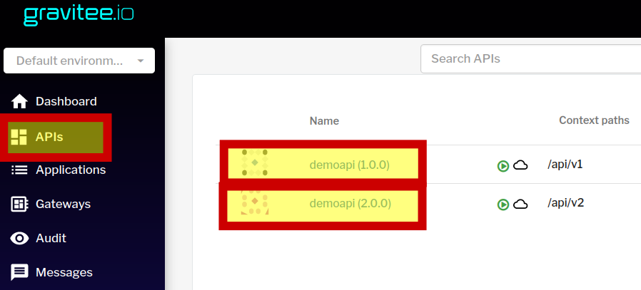
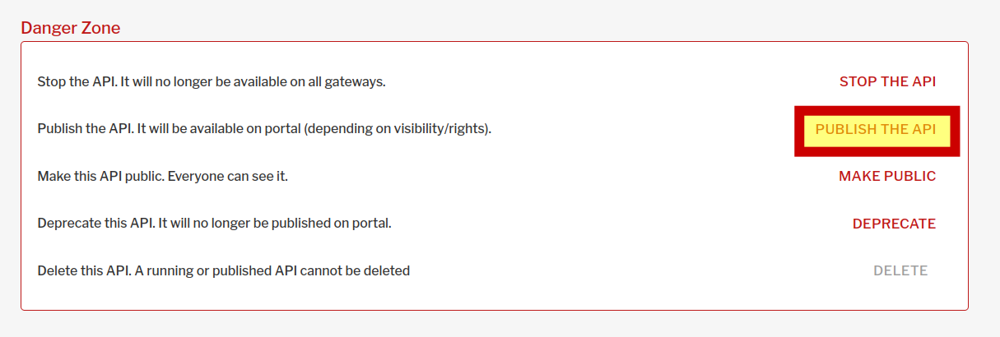
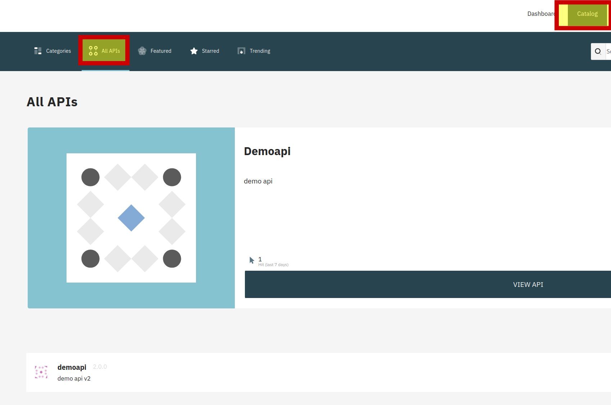
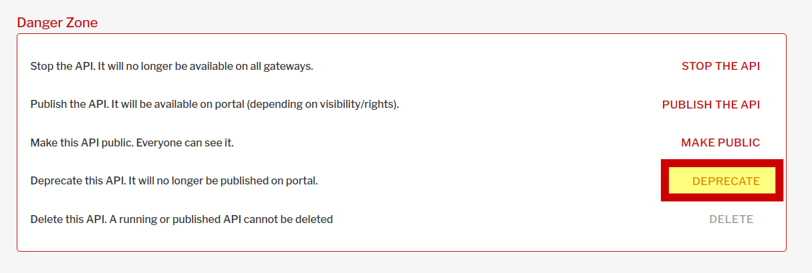

### Авторизация в gravitee apim
Откроем интерфейс gravitee apim по ссылке [gravitee ](https://[[HOST_SUBDOMAIN]]-32100-[[KATACODA_HOST]].environments.katacoda.com/)  и авторизуемся в нем  
```
права администратора
user: admin
pasword: admin
```
### Публикация api на портал
Откроем поочередно наши функции



и опубликуем их на портале


### Просмотр версий api

Откроем в новой вкладке [портал](https://[[HOST_SUBDOMAIN]]-32100-[[KATACODA_HOST]].environments.katacoda.com/portal-ui)

Перейдем в каталог и просмотрим все доступные для пользователей апи
Видим 2 версии нашего  Demoapi


### Deprecate api

Предположим, версия 1.0.0 Demoapi устарела, мы не хотим выводить ее на портале и давать возможность ее использования новым пользователям.

Откроем интерфейс gravitee apim по ссылке [gravitee ](https://[[HOST_SUBDOMAIN]]-32100-[[KATACODA_HOST]].environments.katacoda.com/) и выберем Demoapi 1.0.0
Нажмем Deprecate, Интерфейс предупредит, что апи помечено как устаревшее.


В портале данная версия больше не отображается, тем не менее для текущих клиентов она все еще доступна.
В данном случае, т.к. апи доступно без авторизации, запрос к нему может выполнить любой клиент. В следующих упражнениях мы рассмотрим доступ к апи на основе подписки.

Проверим доступность, выполнив запрос к версии 1.0.0
`curl http://localhost:32100/gateway/api/v1`{{execute}}

