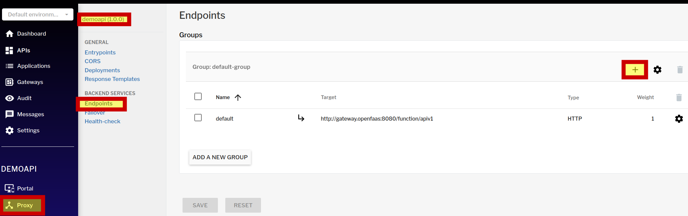
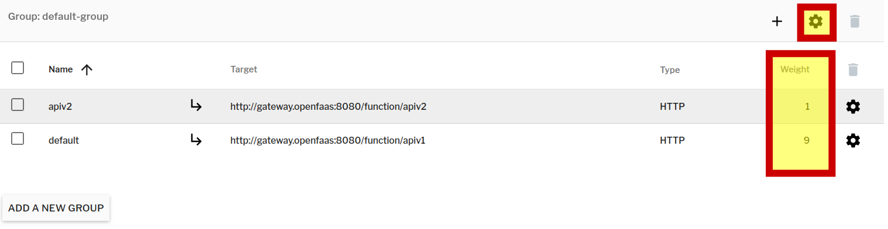
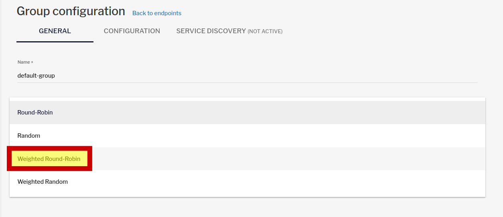
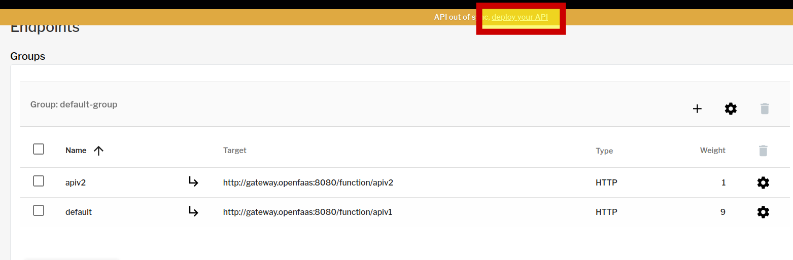
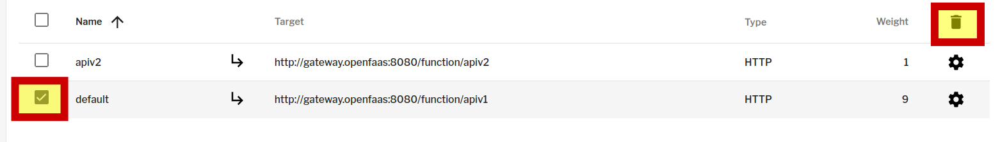

###  Создание новой версии
Предположим, текущая версия нашего демонстрационного api Содержит ошибку. Мы хотим выкатить фикс с использованием канареечного деплоя.
Создадим еще одну функцию из темплейта, которая будет возвращать текст "Version_2":

`faas-cli new --lang python3-sbercode apiv2 && sed -i 's/Hello from OpenFaaS!/Version_2/' ~/apiv2/handler.py &&  sed -i 's/Hello from OpenFaaS!/Version_2/' ~/apiv2/handler_test.py && faas-cli up -f apiv2.yml`{{execute}}

Дождемся, пока статус пода станет Ready.  
`kubectl wait -n openfaas-fn --for=condition=ContainersReady --timeout=5m --all pods`{{execute}}  

### Публикация новой версии

Канареечны деплой предполагает что на новую версию функции будет перенаправлен небольшой % запросов для оценки стабильности работы.
Перенаправим 10% траффика на новую версию.

Откроем интерфейс gravitee apim по ссылке [gravitee ](https://[[HOST_SUBDOMAIN]]-32100-[[KATACODA_HOST]].environments.katacoda.com/)  и авторизуемся в нем  
```
права администратора
user: admin
pasword: admin

```

Переходим на страницу нашего апи и добавляем еще один бэкенд (новая версия) с весом 1. Вес текущей версии указываем 9. 


Кроме того, меняем тип балансировки на "Weighted Round-Robin". 
 
Таким образом 90% траффика остается на текущей версии и 10% направляется на новую.  
Сохраняем изменения и публикуем их.
 

Проверим настройки, выполнив 20 обращений к апи
for i in {1..20}; do echo "$(curl -s  http://localhost:32100/gateway/api/v1)"; done

пример вывода:
```
Hello from OpenFaaS!
Version_2
Hello from OpenFaaS!
Hello from OpenFaaS!
Hello from OpenFaaS!
Hello from OpenFaaS!
Hello from OpenFaaS!
Hello from OpenFaaS!
Hello from OpenFaaS!
Hello from OpenFaaS!
Hello from OpenFaaS!
Version_2
Hello from OpenFaaS!
Hello from OpenFaaS!
Hello from OpenFaaS!
Hello from OpenFaaS!
Hello from OpenFaaS!
Hello from OpenFaaS!
Hello from OpenFaaS!
Hello from OpenFaaS!
```
Заметим, что 10% запросов попадают на новую версию согласно настройкам.

После успешного тестирования новой версии на нее перенаправляется 100% траффика, а старая версия выводится из эксплуатации. 
Для этого переходим на страницу управления эндпоинтами и корректируем настройки.
 
Применяем изменения и проверяем, что весь траффик направляется на новую версию.
for i in {1..10}; do echo "$(curl -s  http://localhost:32100/gateway/api/v1)"; done

пример вывода:

```
Version_2
Version_2
Version_2
Version_2
Version_2
Version_2
Version_2
Version_2
Version_2
Version_2
```