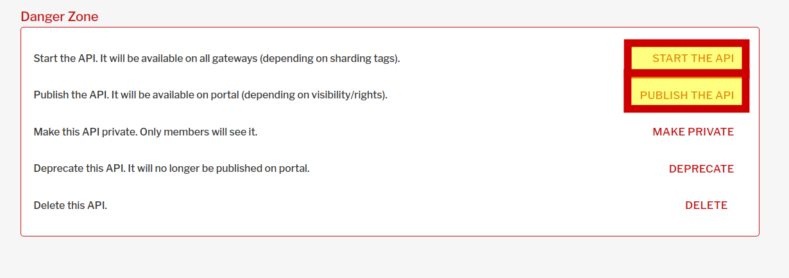

###  Создание и публикация функции через gravitee api gateway
Cоздадим функцию из темплейта и выполним ее сборку и деплой:

`faas-cli new --lang python3-sbercode fn2 && faas-cli up -f fn2.yml`{{execute}}

Импортируем файл описания апи для нашей функции командой

`curl -u admin:admin -H "Content-Type:application/json;charset=UTF-8" -d @serverless-example-1-0-0.json    http://localhost:32100/management/organizations/DEFAULT/environments/DEFAULT/apis/import`{{execute}}

### Авторизация в gravitee apim
Откроем интерфейс gravitee apim по ссылке [gravitee ](https://[[HOST_SUBDOMAIN]]-32100-[[KATACODA_HOST]].environments.katacoda.com/)  и авторизуемся в нем  как администратор
```
права администратора
user: admin
pasword: admin
```
Далее переходим в интерфейсе gravitee на вкладку APIs, находим импортированное api, стартуем и публикуем его.   
 

### Попытка  вызова функции

Согласно настройкам плана api fn2 публично не доступно, для обращения нужен API key. Проверим это запросом:

`curl http://localhost:32100/gateway/fn2`{{execute}}
Получаем 401 ошибку, нужен ключ доступа в заголовке `X-Gravitee-Api-Key`. Если получаете ответ "No context-path matches the request URI." - api gateway еще не успел развернуть endpoint. Попробуйте повторить через 3-5 сек.