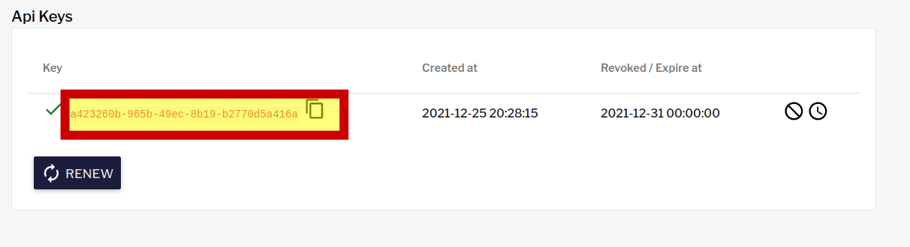

### Валидация запроса на доступ

Выходим из системы и авторизуемся в [консоли](https://[[HOST_SUBDOMAIN]]-32100-[[KATACODA_HOST]].environments.katacoda.com/) admin/admin
- в правом верхнем углу нажимаем на аватар и выбираем "Tasks"
- видим запрос на подписку, нажимаем "VALIDATE"
- нажимаем "ACCEPT", Выбираем время действия подписки. В случае монетизации апи пользователь должен быть выдан доступ согласно оплаченному плану и на указанный срок. Указываем с текущей даты, например, на месяц. По истечению доступ данному приложению к api будет автоматически прекращен. При необходимости можно оставить сообщение для владельца приложения.
- после создания в интерфейсе доступен ключ. Также администратор может изменить дату истечения подписки или приостановить/закрыть ее.
- ключ будет доступен пользователю user на [портале](https://[[HOST_SUBDOMAIN]]-32100-[[KATACODA_HOST]].environments.katacoda.com/portal-ui)  в созданном приложении.
 

### Вызова функции с ключом доступа
Копируем ключ в файл `~/apikey` вместо текста "UID_KEY_HERE" и заново пробуем выполнить запрос:
`curl -H @apikey http://localhost:32100/gateway/fn2`{{execute}}
Если все сделано верно - функция вернет дефолтный текст.
```
Hello from OpenFaaS!
```