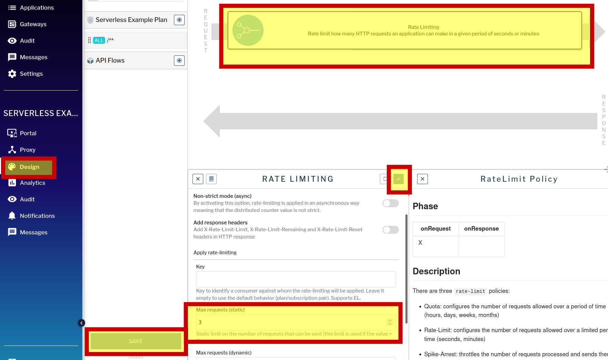
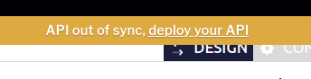

### Рейтлимит запросов

В текущем плане подписки нашего приложения установлен рейтлимит 3 запроса/мин. Еще несколько раз вызовем функцию и получим следующий ответ:
```
{"message":"Rate limit exceeded ! You reach the limit of 3 requests per 1 minutes","http_status_code":429}
```
Давайте изменим настройки рейтлимита.  
Откроем интерфейс gravitee apim по ссылке [gravitee ](https://[[HOST_SUBDOMAIN]]-32100-[[KATACODA_HOST]].environments.katacoda.com/#!/environments/DEFAULT/apis/b7c385f6-b73a-49d8-8385-f6b73ae9d8ea/portal)  

Перейдем в настройки плана для нашего api и увеличим количество доступных запросов до 5 в минуту.  А также включим в респонс рейтлимит заголовки

 

Опубликуем изменения

 

проверим изменения запросом:

`curl -v -H @apikey http://localhost:32100/gateway/fn2`{{execute}}

Должны присутствовать заголовки X-Ratelimit-*:

```
< X-Rate-Limit-Limit: 5 - текущий лимит
< X-Rate-Limit-Remaining: 4 - осталось попыток в текущем лимите
< X-Rate-Limit-Reset: 1640505306497 - время окончания текущего лимита в формате timstamp
```

После 5 запросов должен быть ответ

```
{"message":"Rate limit exceeded ! You reach the limit of 5 requests per 1 minutes","http_status_code":429}
```