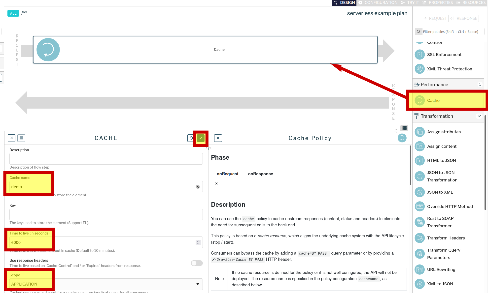

### Авторизация в gravitee apim
Откроем интерфейс gravitee apim по ссылке [gravitee ](https://[[HOST_SUBDOMAIN]]-32100-[[KATACODA_HOST]].environments.katacoda.com/)  и авторизуемся в нем  
```
права администратора
user: admin
pasword: admin
```
### Настройка кеширования
После авторизации в интерфейсе переходим на вкладку "APIs", выбираем наше апи и переходим в дизайнер.

Добавляем в запрос элемент кеширования и настраиваем параметры
* cache name: cache1
* Time to live: 6000
* Scope: APPLICATION - отдельный кеш для каждого приложения (ключа доступа)
 

Сохраняем изменения и публикуем их, нажав "deploy" вверху экрана.

Продолжаем наблюдать за счетчиком количества вызовов функции. Через некоторое время значение перестанет увеличиваться, т.к. запросы от нашего клиента попадают в кеш api gateway и вызова функции не происходит.