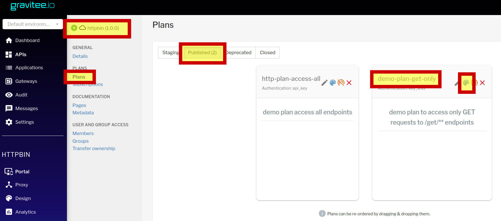
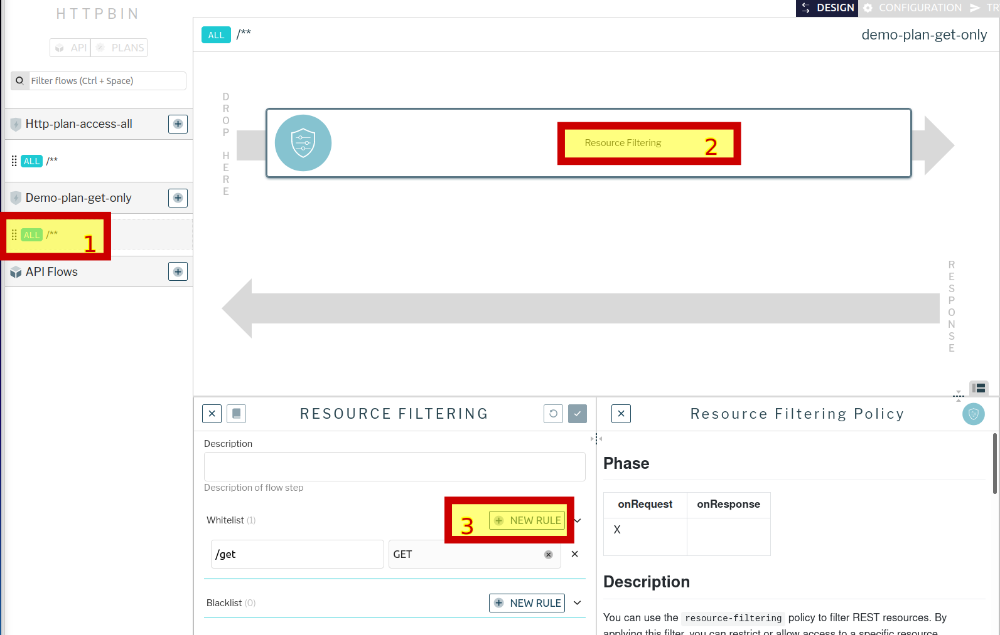
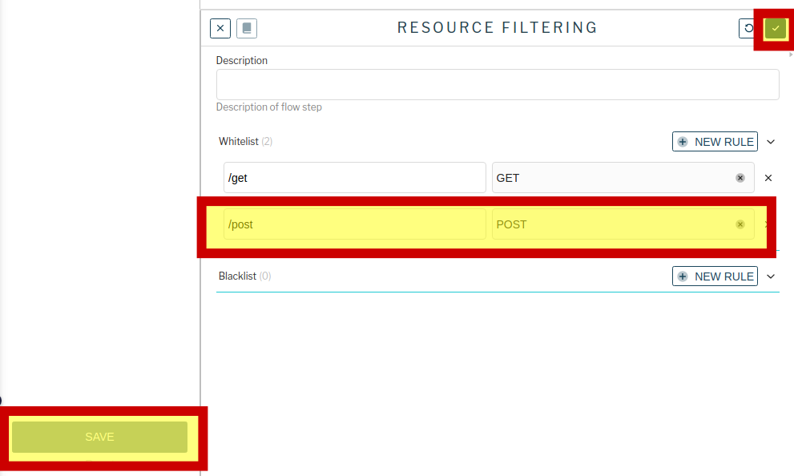

### Авторизация в gravitee apim
Откроем интерфейс gravitee apim по ссылке [gravitee ](https://[[HOST_SUBDOMAIN]]-32100-[[KATACODA_HOST]].environments.katacoda.com/)  и авторизуемся в нем  
```
права администратора
user: admin
pasword: admin
```
### Настройки плана публичного доступа
Изменим правила публичного доступа к апи, добавив в план доступ к /post для POST запросов.

откроем импортированное апи и перейдем в дизайнер плана demo-plan-get-only
 
Выберем  компонент "Resource filtering" и добавим в белый список еще один endpoint

После чего сохраним изменения.

И далее  опубликуем их, нажав "deploy" вверху экрана.

Проверим изменения, выполнив запрос типа POST без авторизации к /post

`curl -XPOST http://localhost:32100/gateway/httpbin/post`{{execute}}
Если все настроено верно - запрос успешно выполнится. 

