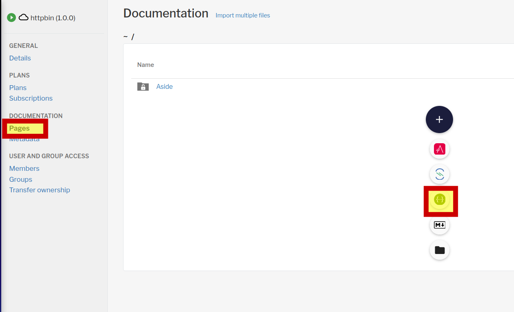
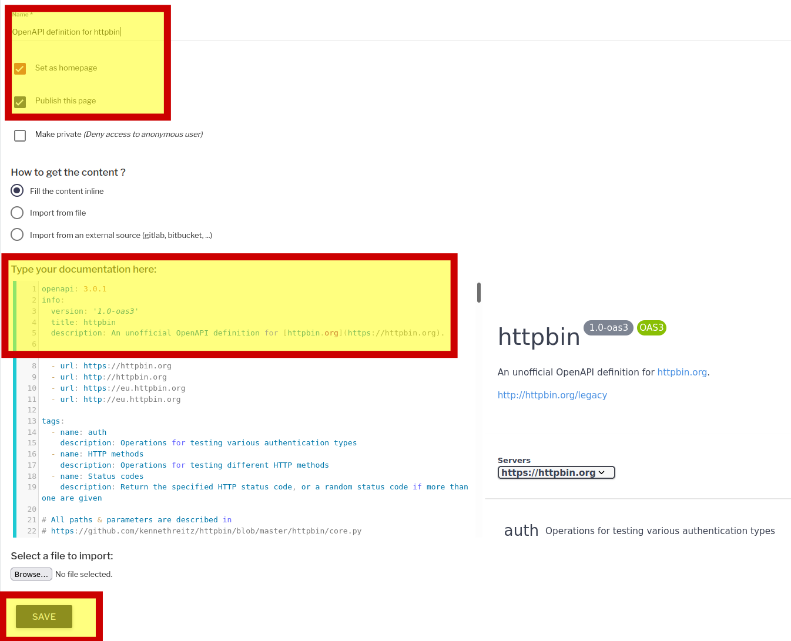
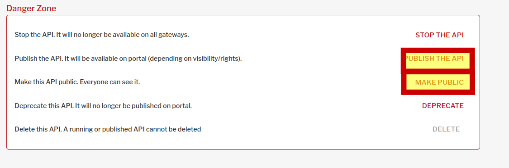

Импортируем файл с готовым описанием апи для httpbin в формате gravitee командой

`curl  -u admin:admin -H "Content-Type:application/json;charset=UTF-8" -d @httpbin-1-0-0.json    http://localhost:32100/management/organizations/DEFAULT/environments/DEFAULT/apis/import`{{execute}}

Стартуем апи командой
`curl  -u admin:admin -X POST http://localhost:32100/management/organizations/DEFAULT/environments/DEFAULT/apis/70baa1f6-0b52-4413-baa1-f60b526413ec?action=START`{{execute}}

### Авторизация в gravitee apim
Откроем интерфейс gravitee apim по ссылке [gravitee ](https://[[HOST_SUBDOMAIN]]-32100-[[KATACODA_HOST]].environments.katacoda.com/)  и авторизуемся в нем  
```
права администратора
user: admin
pasword: admin
```
### Добавление документации к апи

Перейдем в наше апи и добавим документацию типа "swagger"
 

Спецификация openapi для нашего сервиса находится в файле
`httpbin-openapi.yaml`{{open}}

Внесем изменения и сохраним их
 

И затем опубликуем наше апи и сделаем его публично доступным на портале
 