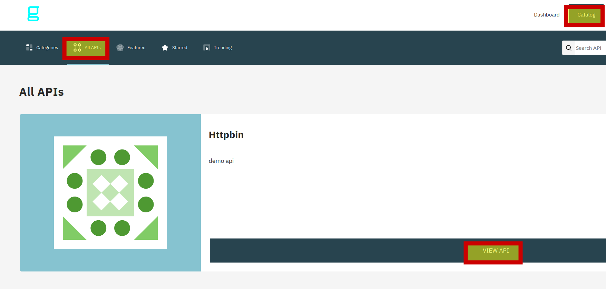
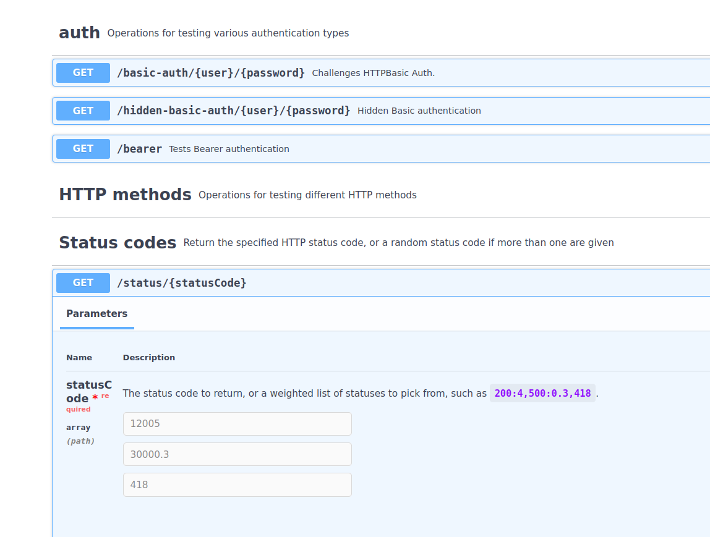

### Просмотр документации на портале

Перейдем в [портал](https://[[HOST_SUBDOMAIN]]-32100-[[KATACODA_HOST]].environments.katacoda.com/portal-ui) и откроем наше апи
 

Для потребителей нашего апи на портале доступна документация в спецификации openapi, которую можно изучить перед формированием запроса на подписку.
 