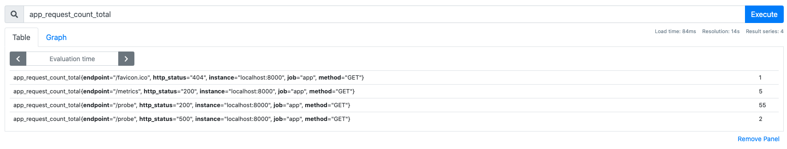
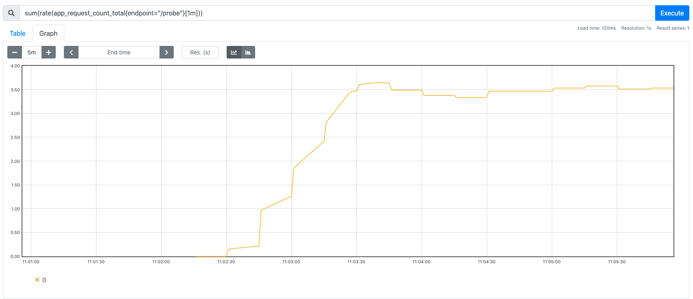
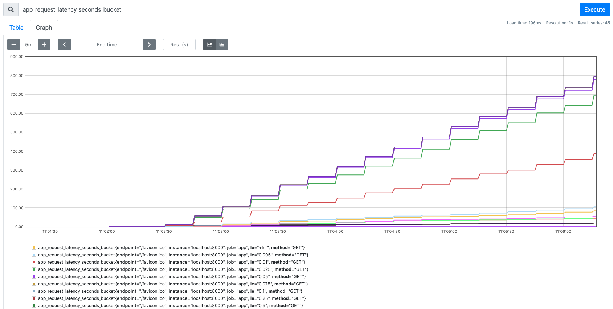

Поселектить и посмотреть метрики можно с помощью языка запросов PromQL в дашборде [тут](https://[[HOST_SUBDOMAIN]]-9090-[[KATACODA_HOST]].environments.katacoda.com/graph)

Для того, чтобы видеть изменения в метриках, давайте нагрузим сервис с помощью команды:

```
load.sh```{{execute}}

Можем увидеть, что как выглядят на самом деле наши метрики. 


Если мы введем метрику в Execute, то тогда мы увидим все временные ряды, которые есть в этой метрике.



Например, метрика app_request_count_total представляет собой несколько временных рядов, но поскольку метрика имеет тип счетчик, то значение метрики является монотонно растущим и мы можем это увидеть на графиках.


Давайте отфильтруем и посмотрим запросы только для эндпоинта /probe.

`app_request_count_total{endpoint="/probe"}`{{copy}}


С помощью функции rate можем вычислить RPS - количество запросов в секунду:

`rate(app_request_count_total{endpoint="/probe"}[1m])`{{copy}}


Если мы хотим общий RPS, без разбивки по отличающимся метками, мы должны суммировать RPS.

`sum(rate(app_request_count_total{endpoint="/probe"}[1m]))`{{copy}}



В среднем получается где-то 3 запроса в секунду.

Важно понимать, что значение точки на графике - это не моментальное значение rps - а среднее значение за какой-то период (1m, 5m и т.д.) в данный момент времени. И чем больше этот период, тем более гладким будет график. 

Давайте попробуем посчитать квантили по времени ответа. Для этого нужно воспользоваться метрикой app_request_latency_seconds_bucket 



Посчитать медианное значение времени ответа можно с помощью вот такого запроса.

`histogram_quantile(0.5, (sum by (le) (rate(app_request_latency_seconds_bucket{endpoint="/probe"}[1m]))))`{{copy}}


В среднем получается 250 миллисекунд - медианное время ответа. 
