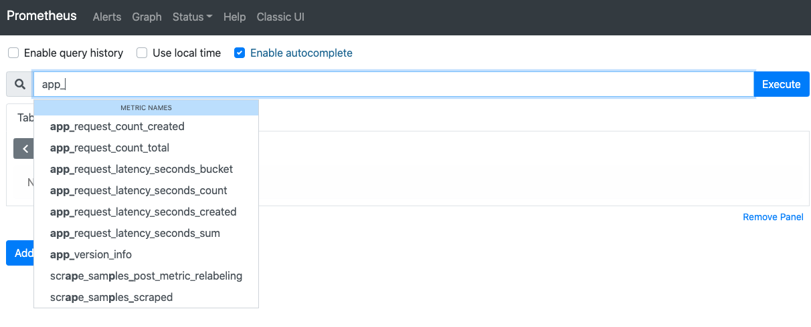

Поселектить и посмотреть метрики можно с помощью языка запросов PromQL в дашборде [тут](https://[[HOST_SUBDOMAIN]]-9090-[[KATACODA_HOST]].environments.katacoda.com/targets)

Можем увидеть, что на самом деле две наших метрики превратились в несколько с помощью клиентской библиотеки. 

Если мы введем метрику в Execute, то тогда мы увидим все временные ряды, которые есть в этой метрике.



Нагружаем сервис с помощью команды:
```
load.sh```{{execute}}

Например, метрика app_request_count_total представляет собой несколько временных рядов, но поскольку метрика имеет тип счетчик, то значение метрики является монотонно растущим и мы можем это увидеть на графиках.


Давайте отфильтруем и посмотрим запросы только для эндпоинта /probe.

app_request_count_total{exported_endpoint="/probe"}

С помощью функции rate можем вычислить RPS запросов 

rate(app_request_count_total{exported_endpoint="/probe"}[1m])

Если мы хотим общий RPS, без разбивки по отличающимся метками, мы должны суммировать RPS.

sum(rate(app_request_count_total{exported_endpoint="/probe"}[5m]))

Важно понимать, что значение точки на графике - это не моментальное значение rps - а среднее значение за какой-то период (1m, 5m и т.д.) в данный момент времени. И чем больше этот период, тем более гладким будет график. 


Давайте попробуем посчитать квантили по времени ответа. Для этого нужно воспользоваться метрикой app_request_latency_seconds_bucket 

Посчитаем медианное значение времени ответа с помощью вот такого запроса.

histogram_quantile(0.5, (sum by (le) (rate(app_request_latency_seconds_bucket{exported_endpoint="/probe"}[1m]))))

За подробностями, как и почему выражение такое, лучше обратиться к учебным материалам.
