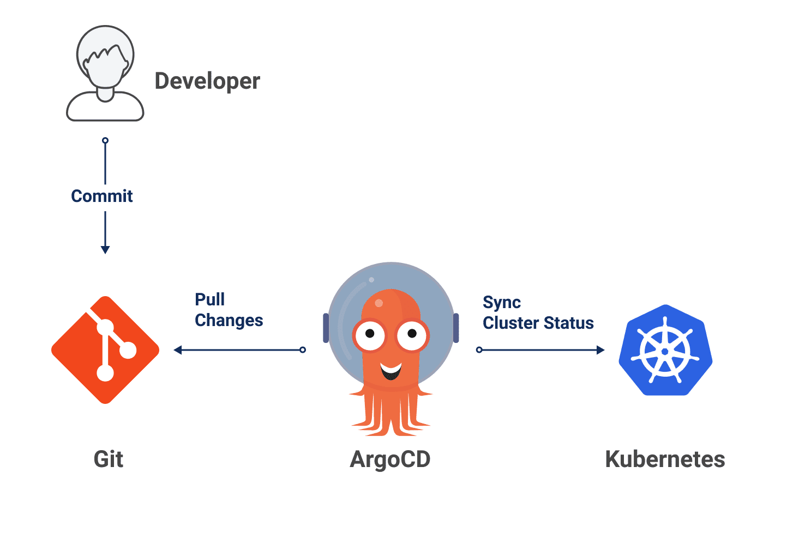
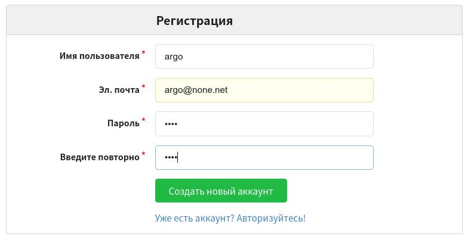
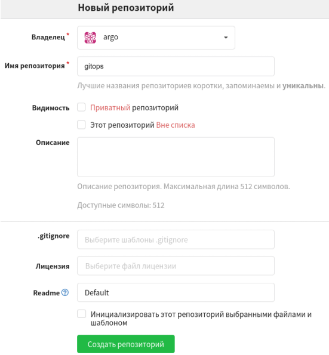

## Настройка окружения для GitOPS

Для  подготовки окружения запустим скрипт: 

`prepare.sh`{{execute}}

скрипт выполняет следующее:
- создает файл переменных окружения ~/envs
- выполняет деплой системных компонент Gogs, ArgoCD
- устанавливает консольную утилиту faas-cli для взаимодействия с OpenFaaS из командной строки
- скачивает темплейт для создания функций на языке python в root/template
- устанавливает gravitee apim

Ожидаем 3-5 мин, пока все компоненты будут успешно инсталлированы. 

### компонент ***Gogs**

Важным компонентом подхода GitOPS является сервис контроля версий Git, в котором совместно хранятся исходный код приложения, а также другие манифесты и конфигурационные файлы, необходимые для запуска приложения в среде Kubernetes. В качестве учебного примера такого сервиса мы будем использовать решение **Gogs** (https://gogs.io/). **Gogs** является легковестным open source аналогом GitHub.  

### компонент ***Argo CD**

Одним из популярных инструментов, используемых в GitOPS является **Argo CD**.

**Argo CD** - это инструмент непрерывного развертывания (CD), ориентированный на Kubernetes. В отличие от внешних CD-инструментов, обеспечивающих только push-развертывание, Argo CD может отслеживать, автоматически извлекать обновленный код из Git-репозиториев и разворачивать его непосредственно на ресурсах Kubernetes. Это позволяет разработчикам управлять как конфигурацией инфраструктуры, так и обновлениями приложений в одной системе.

Когда происходит фиксация (обычно обновляющая версии артефактов образа), **Argo CD** запускает процесс «синхронизации», который отвечает за приведение конфигурации кластера в то же состояние, как описано в Git.

Когда процесс синхронизации завершен, мы знаем, что конфигурация приложения точно такая же, как в манифестах Git.

Несмотря на то, что процесс синхронизации жизненно важен для выполнения первоначального развертывания приложения, одной из сильных сторон **Argo CD** является непрерывный мониторинг обоих состояний (кластера и Git) *после* развертывания. Этот непрерывный мониторинг очень важен для решения проблемы дрейфа конфигурации, который является очень распространенной проблемой в организациях с большим количеством целей развертывания.
### Проверка деплойментов
После завершения работы скрипта получим список запущенных подов в кластере и убедимся что у всех статус Running

`kubectl get po -A  | grep -v Complete`{{execute}}

### Настройка репозитория
После проверки откроем [web-интерфейс gogs](https://[[HOST_SUBDOMAIN]]-32100-[[KATACODA_HOST]].environments.katacoda.com/gogs/) 

Нажмем кнопку "Регистрация" в верхнем правом углу интерфейса gogs и зарегистрируемся.  
Имя пользователя - **argo**  
Пароль - произвольно, можно такой же как имя  
Эл. почта - произвольно, в формате почтового адреса  

  

Далее создадим тестовый репозиторий **gitops**  

 


Для подготовики репозитория запустим скрипт, он добавит в него локально расположенные файлы с настройками  
`~/prepare_repo.sh`{{execute}}  
Скрипт попросит имя/пароль зарегестрированного в gogs пользователя, указываем  
```shell
Writing objects: 100% (3/3), 850 bytes | 850.00 KiB/s, done.
Total 3 (delta 0), reused 0 (delta 0)
Username for 'http://localhost:32100': argo
Password for 'http://argo@localhost:32100': 
To http://localhost:32100/argo/gitops
 * [new branch]      HEAD -> master
```

Откроем заново страницу с репозиторием и убедимся, что в нем появилась директория app  и файл с деплойментом тестового приложения.

На этом настройка сервиса Git репозитория для хранения исходного кода приложения считается завершенной.


После успешной запуска всех компонентов **Argo CD** необходимо подключить новый проект для отслеживания. Выполним для этого следующую команду  
`kubectl apply -n argocd -f argocd-project.yaml`{{execute}}

На этом предварительная настройка окружения завершена.


