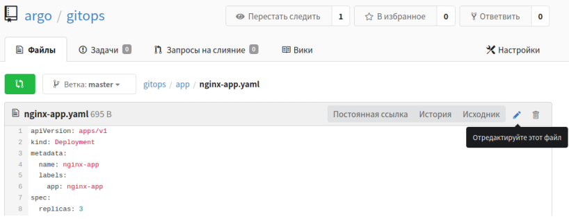

### Развертывание приложения
Добавим в созданный проект конфигурацию для нашего приложения

Изучим манифест:  
`application.yaml`{{open}}  
и применим его  
`kubectl apply -n argocd -f application.yaml`{{execute}}

После этого argocd должен из конфигурации в gogs  развернуть в кластере наше приложение с указанным количеством реплик. Проверить их наличие можно командой  

`kubectl get po -n app`{{execute}}

После успешного развертывания результат будет такой
```shell
~# kubectl get po -n app
NAME                        READY   STATUS    RESTARTS   AGE
nginx-app-d68f4f689-smmbh   1/1     Running   0          15m
nginx-app-d68f4f689-c9l77   1/1     Running   0          15m
```
### Внесение изменений

Перейдем в веб-интерфейс gogs и в режиме редактирования изменим кол-во реплик нашего приложения, добавим еще одну  

 

Закоммитим изменения, нажав "Фиксация изменений" под редактируемым файлом и дождемся когда argocd применит новую конфигурацию на кластере. У argocd таймаут 3 мин между отслеживанием состояния + время на развертывание.

Логи контроллера argocd  можно посмотреть командой  
`kubectl logs -n argocd argocd-application-controller-0 --tail 20`{{execute}}

После успешного применение видим, что кол-во реплик увеличено до 3
```shell
~# kubectl get po -n app
NAME                        READY   STATUS    RESTARTS   AGE
nginx-app-d68f4f689-v4qnj   1/1     Running   0          5m39s
nginx-app-d68f4f689-sztz8   1/1     Running   0          5m39s
nginx-app-d68f4f689-n8hwk   1/1     Running   0          44s